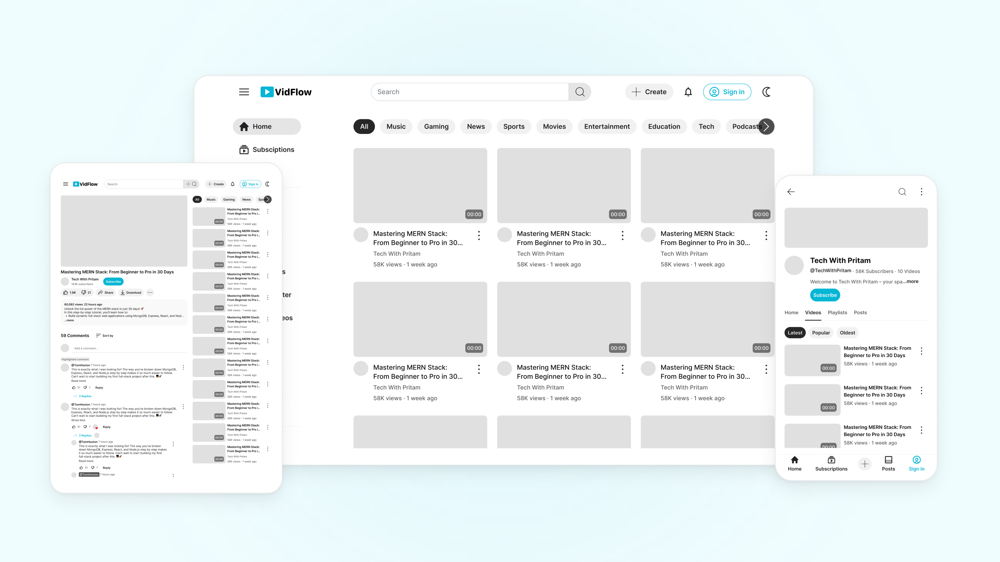

# VidFlow

VidFlow is a backend focused video streaming platform that demonstrates secure authentication, media management, subscriptions, watch history tracking, playlists, likes, comments, and community features.

Built with Node.js, Express, MongoDB, JWT, and Cloudinary, the project focuses on scalable API design, efficient database querying with aggregation pipelines, and maintainable backend architecture commonly used in modern web applications.

Source Code: https://github.com/pritamsardar-dev/portfolio-video-stream-platform-v1 &nbsp;|&nbsp; Case Study: https://pritamsardar.dev/case-study/portfolio-video-stream-platform-v1

---

<picture>
  <source media="(prefers-color-scheme: dark)" srcset=".github/images/vidflow-hero-dark.png">
  
</picture>

---

## Features

* Register and log in with secure JWT access and refresh token flow
* Upload and replace avatar and cover image with automatic Cloudinary lifecycle management
* View channel profiles with live subscriber counts and subscription status
* Subscribe and unsubscribe from channels
* Track and retrieve full watch history with nested video and owner data
* Manage playlists, likes, comments, and community posts
* Paginate video and comment queries using MongoDB aggregate pagination
* Refresh access tokens silently without re-authenticating

---

## Tech Stack

**Backend:** Node.js, Express

**Database:** MongoDB, Mongoose

**Auth:** JWT, bcrypt

**File Uploads:** Multer, Cloudinary

**Design:** Figma (UI complete, frontend development planned)

---

## Getting Started

### Prerequisites

* Node.js 18 or higher
* MongoDB local instance or Atlas account

### Clone and install

```bash
git clone https://github.com/pritamsardar-dev/portfolio-video-stream-platform-v1.git
cd portfolio-video-stream-platform-v1/server
npm install
```

### Environment variables

Create a `.env` file inside the `server` directory:

```env
PORT=8000
MONGODB_URI=your_mongodb_connection_string
CORS_ORIGIN=http://localhost:5173

ACCESS_TOKEN_SECRET=your_access_token_secret
ACCESS_TOKEN_EXPIRY=1d

REFRESH_TOKEN_SECRET=your_refresh_token_secret
REFRESH_TOKEN_EXPIRY=10d

CLOUDINARY_CLOUD_NAME=your_cloud_name
CLOUDINARY_API_KEY=your_api_key
CLOUDINARY_API_SECRET=your_api_secret
```

### Run locally

```bash
npm run dev
```

API runs at `http://localhost:8000`.

---

## Project Structure

```
server/
├── src/
│   ├── controllers/
│   │   └── user.controller.js    # Auth, profile, media update, channel, history
│   ├── middlewares/
│   │   ├── auth.middleware.js    # JWT verification and user attachment
│   │   └── multer.middleware.js  # Multipart file handling with temp disk storage
│   ├── models/
│   │   ├── user.model.js         # Schema with bcrypt hooks and token generators
│   │   ├── video.model.js        # Video schema with aggregate paginate plugin
│   │   ├── comment.model.js      # Comment schema with aggregate paginate plugin
│   │   ├── like.model.js         # Polymorphic likes across videos, comments, tweets
│   │   ├── playlist.model.js     # Playlist schema with video references
│   │   ├── subscription.model.js # Subscriber and channel relationship schema
│   │   └── tweet.model.js        # Community post schema
│   ├── routes/
│   │   └── user.routes.js        # All user and channel route definitions
│   ├── utils/
│   │   ├── ApiError.js           # Standardized error class with status codes
│   │   ├── ApiResponse.js        # Standardized success response wrapper
│   │   ├── asyncHandler.js       # Promise-based async error forwarding
│   │   └── cloudinary.js         # Upload and delete helpers with local cleanup
│   ├── config/
│   │   └── env.config.js         # Dotenv initialization
│   ├── db/
│   │   └── index.js              # MongoDB connection with process exit on failure
│   ├── app.js                    # Express setup with CORS, body parsing, cookies
│   ├── constants.js              # Database name constant
│   └── index.js                  # Server entry point
```

---

## Technical Notes

### JWT access and refresh token strategy

The auth system issues two tokens on login: a short-lived access token and a long-lived refresh token. The refresh token is persisted to the user document in MongoDB and stored in an httpOnly cookie on the client. When the access token expires, the client sends the refresh token to `/refresh-token`. The server verifies it against the stored value before issuing a new access token. This means revocation works at the database level since clearing the stored refresh token immediately invalidates all outstanding sessions for that user.

### MongoDB aggregation pipelines

Channel profiles and watch history are built using aggregation rather than simple find queries. The channel profile pipeline joins the subscriptions collection twice: once to count subscribers and once to count the channels the user is subscribed to. It also resolves whether the requesting user is subscribed by checking if their ObjectId appears in the subscriber array, all in a single database round trip. The watch history pipeline uses a nested lookup to join videos and then owners inside a sub-pipeline, returning fully populated history entries without multiple sequential queries.

### Cloudinary image lifecycle

Avatar and cover image updates follow a replace-then-verify pattern. When a user uploads a new image, the old asset is deleted from Cloudinary using its stored public ID before the new upload begins. If the delete call returns anything other than `ok` or `not found`, the update is rejected early and the new file is never uploaded. This keeps the Cloudinary account clean and prevents orphaned assets accumulating over time.

---

## Future Ideas

* Frontend implementation with React 19 and Tailwind CSS v4 based on completed Figma designs
* Video upload and streaming with Cloudinary video resource support
* Video, comment, and playlist controllers to complete the full API surface
* Real-time notifications for new uploads from subscribed channels
* Admin dashboard for content moderation and analytics

---

## License

Licensed under the MIT License. See [LICENSE](./LICENSE) for details.

---

## Author

**Pritam Sardar**

GitHub: [github.com/pritamsardar-dev](https://github.com/pritamsardar-dev)

LinkedIn: [linkedin.com/in/pritam-sardar-dev](https://www.linkedin.com/in/pritam-sardar-dev/)

Portfolio: [pritamsardar.dev](https://pritamsardar.dev)

Email: [pritamsardar.dev@gmail.com](mailto:pritamsardar.dev@gmail.com)